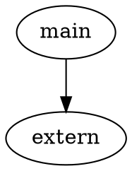

Interfaces

We need a way to do things in the engine.

What do we want to be able to do?
Custom Actors
 - Drawing
 - Game logic
Custom items (?)
Sounds
Visuals
 - Models
 - Textures
 - Shaders
Manipulate global variables
Serialization and deserialization in saves
in-game UI
Overlay imgui

